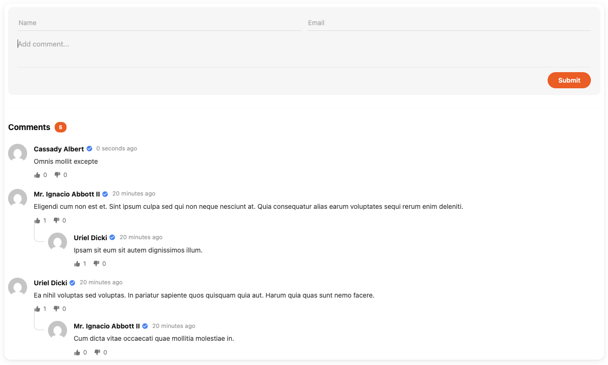
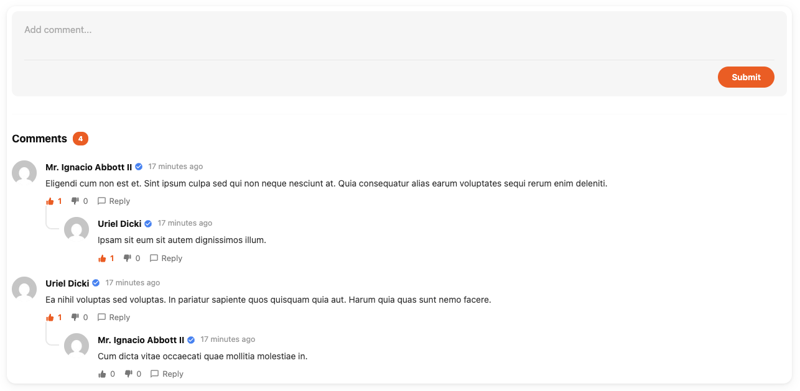
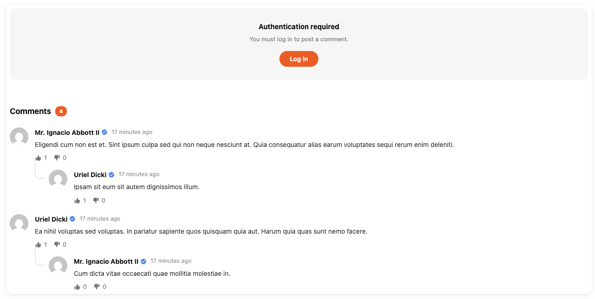

# anil/comments

A full-featured commenting system for Laravel. Attach comments to any Eloquent model with threaded replies, reactions, guest commenting, approval workflows, and a framework-agnostic UI — all in one package.

## Features

- Comment on any Eloquent model (polymorphic)
- Threaded replies with configurable nesting depth
- Reactions system (like/dislike, or any custom types)
- Guest commenting with honeypot spam protection
- Comment approval workflow
- Soft deletes (opt-in)
- Pagination (top-level comments)
- Rate limiting
- Authorization via Laravel gates/policies
- Events dispatched on create, update, and delete
- Framework-agnostic UI (no Bootstrap or Tailwind required)
- Gravatar avatars with color-coded initials fallback
- 13 supported locales
- Full REST API
- Support for multiple User models and non-integer IDs
- N+1 query optimized


## Screenshots

**Guest user** (guest commenting enabled — name and email fields shown):



**Logged-in user** (comment form without guest fields, reply button visible):



**Logged-out user** (guest commenting disabled — authentication prompt shown):




## Requirements

- PHP 8.2+
- Laravel 11, 12, or 13


## Installation

```bash
composer require anil/comments
php artisan migrate
```


## Setup

### 1. Add `Commenter` trait to your User model

```php
use Anil\Comments\Commenter;

class User extends Authenticatable
{
    use Notifiable, Commenter;
}
```

### 2. Add `Commentable` trait to any model you want to comment on

```php
use Anil\Comments\Commentable;

class Post extends Model
{
    use Commentable;
}
```

### 3. Render the comments component in your view

```blade
@comments(['model' => $post])
```

That's it. The package auto-detects the authenticated user and renders the full comment UI.


## Blade Component Options

```blade
@comments([
    'model'                => $post,       // required — the commentable model
    'approved'             => true,        // show only approved comments (default: all)
    'perPage'              => 10,          // paginate top-level comments
    'maxIndentationLevel'  => 3,           // override max reply nesting (default: config value)
    'reactionsEnabled'     => true,        // override config
    'reactionTypes'        => ['like', 'dislike'], // override config
    'sort'                 => 'latest',    // 'latest' or 'oldest'
])
```

### Pagination

Pagination applies to top-level comments only. A parent comment and all of its replies count as one "page unit" — so `perPage => 2` shows two parent comments plus all their children.

### Nesting depth

By default replies nest up to level 3:

```
- 0
    - 1
        - 2
            - 3
```

Replies beyond the max depth are shown at the deepest level. Override per-component with `maxIndentationLevel` or globally via config (`max_depth`).


## Configuration

Publish the config file:

```bash
php artisan vendor:publish --provider="Anil\Comments\ServiceProvider" --tag=config
```

Key options in `config/comments.php`:

| Key | Default | Description |
|-----|---------|-------------|
| `model` | `Comment::class` | Custom Comment model |
| `reaction_model` | `CommentReaction::class` | Custom reaction model |
| `controller` | `WebCommentController::class` | Custom controller |
| `routes` | `true` | Register package routes |
| `load_migrations` | `true` | Auto-load package migrations |
| `approval_required` | `false` | Require admin approval before comments are visible |
| `guest_commenting` | `true` | Allow unauthenticated users to comment |
| `soft_deletes` | `false` | Use soft deletes instead of hard deletes |
| `max_depth` | `3` | Maximum reply nesting level |
| `sort` | `'latest'` | Default comment sort (`'latest'` or `'oldest'`) |
| `reactions.enabled` | `true` | Enable the reactions system |
| `reactions.types` | `['like', 'dislike']` | Allowed reaction types |
| `rate_limiting.enabled` | `true` | Enable rate limiting on comment submission |
| `rate_limiting.max_attempts` | `10` | Max submissions per window |
| `rate_limiting.decay_minutes` | `1` | Rate limit window in minutes |
| `middleware` | `['web']` | Middleware applied to comment routes |
| `permissions` | Array | Gate → policy method mappings |
| `validation.*` | Array | Override validation rules for each action |
| `response_status` | Array | HTTP status codes for create/update/delete |
| `response_messages` | Array | Response message strings |


## Publishing Assets

```bash
# Views
php artisan vendor:publish --provider="Anil\Comments\ServiceProvider" --tag=views

# Migrations
php artisan vendor:publish --provider="Anil\Comments\ServiceProvider" --tag=migrations

# Translations
php artisan vendor:publish --provider="Anil\Comments\ServiceProvider" --tag=translations

# All at once
php artisan vendor:publish --provider="Anil\Comments\ServiceProvider" --tag=comments
```


## Authorization

The package registers Laravel gates backed by `CommentPolicy`:

| Gate | Default rule |
|------|-------------|
| `create-comment` | Any authenticated user |
| `edit-comment` | Comment author only |
| `delete-comment` | Comment author or user with `is_admin = true` |
| `reply-to-comment` | Any authenticated user (cannot reply to own comment) |

You can override the gate-to-policy mappings in `config/comments.php` under `permissions`, or publish and modify `CommentPolicy` directly.


## Reactions

Reactions are enabled by default. Each user can have one reaction per comment. Sending the same reaction type again removes it (toggle). Sending a different type switches it.

Configure types in `config/comments.php`:

```php
'reactions' => [
    'enabled' => true,
    'types'   => ['like', 'dislike'],
],
```

Any string values are valid reaction types.


## Guest Commenting

When `guest_commenting` is enabled, unauthenticated users can submit comments with a `guest_name` and `guest_email`. Honeypot spam protection (via `spatie/laravel-honeypot`) is automatically applied.

Disable guest commenting to show a login prompt instead:

```php
'guest_commenting' => false,
```


## Events

The package dispatches the following events (all implement `SerializesModels` for queued listeners):

| Event | Fired when |
|-------|-----------|
| `Anil\Comments\Events\CommentCreated` | A comment is created |
| `Anil\Comments\Events\CommentUpdated` | A comment is edited |
| `Anil\Comments\Events\CommentDeleted` | A comment is deleted |

Register listeners in your `EventServiceProvider` as normal.


## REST API

All routes are prefixed with `/comments` and named with `comments.*`.

| Method | URI | Name | Description |
|--------|-----|------|-------------|
| POST | `/comments` | `comments.store` | Create a comment |
| PUT | `/comments/{comment}` | `comments.update` | Edit a comment |
| DELETE | `/comments/{comment}` | `comments.destroy` | Delete a comment |
| POST | `/comments/{comment}` | `comments.reply` | Reply to a comment |
| POST | `/comments/{comment}/react` | `comments.react` | Toggle a reaction |

### POST `/comments`

```json
{
    "commentable_type": "App\\Models\\Post",
    "commentable_id": "1",
    "message": "Great post!"
}
```

Guest fields (required when unauthenticated and guest commenting is enabled):

```json
{
    "guest_name": "Jane Doe",
    "guest_email": "jane@example.com"
}
```

### PUT `/comments/{comment}`

```json
{
    "message": "Updated comment text."
}
```

### POST `/comments/{comment}` (reply)

```json
{
    "message": "Reply text."
}
```

### POST `/comments/{comment}/react`

```json
{
    "type": "like"
}
```

Returns:

```json
{
    "reaction_counts": { "like": 3, "dislike": 1 },
    "user_reaction": "like"
}
```


## Queryable Methods (Commentable trait)

These methods are available on any model using the `Commentable` trait:

```php
$post->comments();                                // all comments
$post->approvedComments();                        // only approved
$post->latestComments(5);                         // 5 most recent
$post->commentsWithReplies();                     // top-level + eager-loaded replies
$post->totalComments();                           // count
$post->commentsByUser($userId, $commenterType);   // filter by user
$post->commentsInDateRange($start, $end);         // date range
$post->commentsWithAttributes(['approved' => true]);
$post->commentsWithRelations(['commenter']);

Post::mostCommented(5);                           // static — top 5 most commented
```


## Lifecycle Hooks

You can define these methods on your **Comment model** (after publishing and extending) or on your **commentable model** to run custom logic around comment operations:

| Method | Trigger |
|--------|---------|
| `afterCreateProcess()` | After a comment is created |
| `afterUpdateProcess()` | After a comment is updated |
| `beforeDeleteProcess()` | Before a comment is deleted |
| `afterDeleteProcess()` | After a comment is deleted |
| `afterReplyProcess()` | After a reply is created |

The service layer calls these hooks when they exist — no base implementation is required.


## Localization

The package ships with translations for 13 locales:

`ar`, `ca`, `de`, `en`, `es`, `fr`, `in`, `it`, `ja`, `nl`, `np`, `pt`, `ru`

Publish translations to customize or add new locales:

```bash
php artisan vendor:publish --provider="Anil\Comments\ServiceProvider" --tag=translations
```


## Custom Controller

To extend or replace the controller, set the `controller` key in config:

```php
'controller' => \App\Http\Controllers\MyCommentController::class,
```

Your controller must implement `Anil\Comments\CommentControllerInterface` or extend `Anil\Comments\CommentController`.


## License

MIT — see [LICENSE](https://opensource.org/licenses/MIT).
